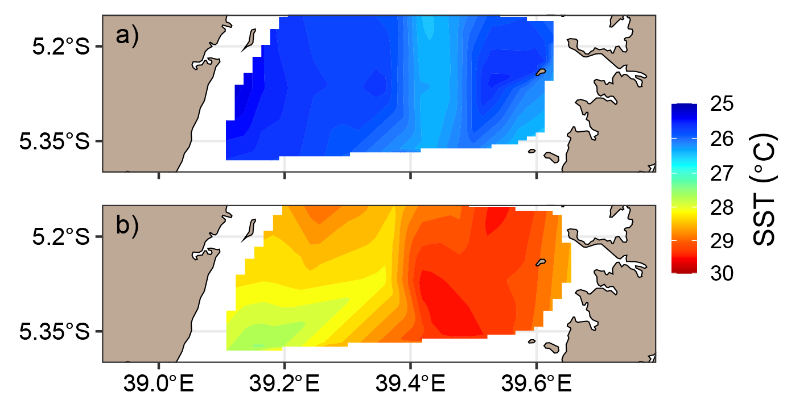

# Results


The results present (a) data from the previous cruises (i) CTD profiles and Sections from ship cruises made during the years 2004, 2008, 2017, and 2018 (ii) ADCP data available from the years 2018, 2017 and 2004, (b) data from field campaigns (i) CTD profiles and Sections from the field campaigns made in 2020 and (ii) ADCP \index{ADCP} data collected in March 2020. 

## 	Previous cruises {#existing}

The composite data set for the coastal\index{coastal} and marine water of Tanzania from the previous expeditions consisted of 93 CTD casts, out of which 22 are from RV \index{Algoa}Algoa during the SE and 33 from RV \index{Agulhas}Agulhas II during the NE monsoon season of 2017. The expedition of SE monsoon season in 2018 with RV Agulhas II deployed 38 casts (Table \@ref(tab:tab5)), which was the largest number of casts compared to the other two expeditions. However, some of the casts of 2018 are outside the jurisdiction of coastal\index{coastal} and marine \index{Marine} waters of \index{Tanzania}Tanzania (figure \@ref(fig:ctd-expeds)).


```{r tab5}
ctd = read_csv("data/ctd_expeditions.csv")

ctd %>% 
  mutate( year = lubridate::year(time),
         month = lubridate::month(time),
         season = if_else(month > 8, "NE", "SE")) %>% 
  distinct(lon, lat,.keep_all = TRUE) %>% 
  group_by(cruise, year, season) %>% summarise(n = n()) %>% 
  mutate(year = as.integer(year),
         cruise = if_else(cruise == "Agulhas", "Agulhas II", "Algoa")) %>% 
  arrange(year) %>% 
  kableExtra::kable(format = "latex", booktab = TRUE, caption = "CTD casts made during different seasons along the coastal and marine waters of Tanzania", align = "c", col.names = c("Cruise", "Expedition Year", "Monsoon Season", "Number of Casts")) %>% 
  kableExtra::kable_styling(latex_options = "hold_position", font_size = 12)
  
  
```

In presenting the data, an attempt was made to strike a balance between a level of detail adequate for describing general distributional features and a useful level for designing future research programs. Even so, the appearance of some figure excess and redundancy is unavoidable since each of the six parameters varies in four dimensions---time, depth, latitude and distance from shore. For previous expeditions, a transect off Kimbiji\index{Kimbiji} was selected because is the only transect that has CTD\index{CTD} casts along the same transects from the three expeditions (Figure \@ref(fig:kimbiji-ctds)). Further, the Kimbiji\index{Kimbiji} transect is washed by East African Coastal Current \index{East African Coastal Current}. The river discharge from the Rufiji\index{Rufiji} Estuary also affect the physical, biological\index{Biological} and chemical\index{Chemical}characteristics of water along the transect. 


```{r kimbiji-ctds, fig.align='center', fig.cap="Transect of CTD casts of the expeditions conducted in 2004, 2017 and 2018 off Kimbiji"}

# 
knitr::include_graphics("graphics/kimbiji_cast.pdf")
```

### Fluorescence \index{Fluoresence} cross-section

The cross section of fluorescence\index{fluoresence} along a transect off--Kimbiji\index{Kimbiji}  (Figure \@ref(fig:kimbiji-ctds)) is shown in Figure \@ref(fig:fl-section). The fluorescence values at the surface water vary with seasons. The surface has relatively higher fluorescence during the southeast\index{Southeast} monsoon season (Figure \@ref(fig:fl-section)a) compared to the northeast\index{Northeast} monsoon season\index{Monsoon season} (Figure \@ref(fig:fl-section)b).


```{r fl-section, fig.align='center', fig.cap="A longitudinal section of fluorescence off Kimbiji during a) southeast and b) northeast"}

# 
knitr::include_graphics("graphics/kimbiji_chl.pdf")
```


### Temperature  cross-section
The cross section of temperature\index{Temperature} along a transect off--Kimbiji (Figure \@ref(fig:kimbiji-ctds)) is shown in Figure \@ref(fig:te-section). The surface water is warmer during the northeast monsoon season (Figure \@ref(fig:te-section)b) and less warm during the southeast monsoon season (Figure \@ref(fig:te-section)a). The strong wind and surface current during the SE monsoon season result in mixing of the surface layer and deepening of the mixed layer depth.


```{r te-section, fig.align='center', fig.cap="A longitudinal section of fluorescence off Kimbiji during a) southeast and b) northeast monsoon season"}

# 
knitr::include_graphics("graphics/kimbiji_temperature.pdf")
```

### Dissolved Oxygen cross-section

The cross section of dissolved oxygen\index{Oxygen} along a transect off--Kimbiji is shown in Figure \@ref(fig:ox-section). The surface water has more dissolved oxygen during the southeast\index{Southeast} monsoon season (Figure \@ref(fig:ox-section)a) compared with the northeast\index{Northeast} monsoon season (Figure \@ref(fig:ox-section)b). The solubility of dissolved oxygen is reduced during the northeast monsoon season because of the elevated temperature and weaken of wind stress.


```{r ox-section, fig.align='center', fig.cap="A longitudinal section of dissolved oxygen off Kimbiji during a) southeast and b) northeast monsoon seasons"}

# 
knitr::include_graphics("graphics/kimbiji_oxygen.pdf")
```


## Field Survey {#in-situ}

Section \@ref(existing) presented result of the Kimbiji \index{Kimbiji} transect as a representative of the previous cruises. The reasons and timing for choosing the Pemba Channel as the case study for hydrographic surveys were described in section \@ref(field). The field campaign conducted in 2020 to complement the data gap of the previous expeditions, deployed a total of 51 casts in the Pemba Channel (Table \@ref(tab:tab0)). Although the survey was planned for 48 casts, in which 24 casts were for each season, a technical error that led to a CTD failing to record one cast during the NE season resulted in one CTD cast less than was planned. Further, there were three more CTD casts during the SE than the 24 orginally planned because during the field campaigns, feature of interest like vorticity were observed and the research team had to capture the phenomenon observed in the field. 


```{r tab0}
field.ctd = read_csv("data/ctd_dsfa_sapphire.csv")

field.ctd = field.ctd %>% 
  mutate(season = if_else(month %in% c(5,6,7,8,9,10), "SE", "NE")) %>% 
  group_by(lon,lat, season)

field.ctd %>% 
  distinct(lon,lat, .keep_all = T) %>% 
  group_by(season) %>% 
  count() %>% 
  ungroup() %>% 
  kableExtra::kable(format = "latex", booktab = TRUE, caption = "Number of CTD cast in the Pemba Channel  during the northeast (NE) and southeast (SE) monsoon seasons", col.names = c("Monsoon Season", "Number of Casts"), align = "c") %>% 
  kableExtra::kable_styling(latex_options = "hold_position", font_size = 11)
```

### Surface Fluorescence

Seasonal surface maps of surface fluorescence in the Pemba Channel is shown in Figure \@ref(fig:field-fl). The values of fluorescence are higher during the SE monsoon (Figure \@ref(fig:field-fl)a) compared to the NE monsoon season (Figure \@ref(fig:field-fl)a). The EACC water is evident as a tongue of low fluorescence during the SE, which lies at the middle of the channel from the south northward of the channel. During the NE monsoon season, however, the same area experiences relatively higher fluorescence values than the western and eastern sides of the channel (Figure \@ref(fig:field-fl)b).  

```{r field-fl, fig.align="center", fig.cap="Fluorescence (Chl-a) concentration sampled in the Pemba Channel during a) southeast and b) northeast monsoon seasons"}

# knitr::include_graphics("graphics/field_fluorescence_se_ne-01.png")
knitr::include_graphics("graphics/field_fluorescence_se_ne.pdf")
```

### Surface temperature

The surface temperature \index{Temperature} in the \index{Pemba}Pemba Channel is shown in Figure \@ref(fig:field-te). The surface water has low temperature during the SE monsoon season (Figure \@ref(fig:field-te)a) compared to the NE season (Figure \@ref(fig:field-te)b). Surface water adjacent to the coast of Pemba Island during the NE monsoon season are warmer than the rest of the channel (Figure \@ref(fig:field-te)a). This can be contributed by the shear velocity of strong vorticity that detach from the EACC during the NE monsoon season. Spatial pattern in the distribution of temperature are similar for the most part of the Pemba Channel during the SE monsoon season (Figure \@ref(fig:field-te)a) . 

```{r field-te, fig.align="center", fig.cap="Surface temperature sampled in the Pemba Channel during the a) southeast and b) the northeast monsoon seasons"}

# 
knitr::include_graphics("graphics/field_temperature_se_ne.pdf")
```

### Surface dissolved oxygen

The surface dissolved oxygen \index{Oxygen} in the Pemba Channel is shown in Figure \@ref(fig:field-ox). Surface dissolved oxygen during the SE monsoon (Figure \@ref(fig:field-ox)a) was higher than those in NE monsoon season (Figure \@ref(fig:field-ox)b). Surface water was in excess of 0.3 mgL^-1^ in the whole channel during the SE monsoon period. 

```{r field-ox, fig.align="center", fig.cap="Surface dissolved oxygen sampled in the Pemba Channel during the a) southeast and b) the northeast monsoon seasons"}

# 
knitr::include_graphics("graphics/field_do_se_ne.pdf")
```


### Fluorescence section

Depth-longitudinal section of seasonal fluorescence \index{Fluorescence} for the Pemba Channel are shown in Figure \@ref(fig:field-flSection). In general, the SE monsoon season is more productive (Figure \@ref(fig:field-flSection)a) than the NE monsoon season (Figure \@ref(fig:field-flSection)b). Both seasons show the presence of high fluorescence values in the mid-water, however, this phenomenon is more pronounced during the NE monsoon season. The doming of high fluorescence values at subsurface water between 30 and 90 meters to about about 39.4$^\circ$E from the coast during the NE monsoon season (Figure \@ref(fig:field-flSection)b) could be contributed by the river discharge from Pangani River, that brings nutrient rich water into the estuary. The discharge of Pangani\index{Pangani} River is pushed northward along with the flow of the EACC and hence nourish the coastal\index{coastal} water on the western side of Pemba, which boost primary productivity in this area during the NE monsoon seasons. 


```{r field-flSection, fig.align="center", fig.cap="Cross-section of fluorescence sampled in the Pemba Channel during a) the southeast and b) the northeast monsoon seasons"}

# 
knitr::include_graphics("graphics/section_field_fluorescence_se_ne.pdf")
```


### Temeperature section

The depth--longitudinal cross-section of temperature \index{Temperature} in the \index{Pemba}Pemba Channel is shown in Figure \@ref(fig:field-teSection). Temperature in the Pemba Channel from the surface to 90 metres deep is 4$^\circ$C warmer during the NE (Figure \@ref(fig:field-teSection)b) compared to the SE monsoon season (Figure \@ref(fig:field-teSection)a) in both seasons, the surface layer is well mixed but the difference in temperature  is the key feature that distinguishes the seasonal variation in the channel. The surface water tempperature is consistently higher on the eastern side of Pemba\index{Pemba} Channel in both season (Figure \@ref(fig:field-teSection)).

```{r field-teSection, fig.align="center", fig.cap="Cross-section of temperature sampled in the Pemba Channel during a) southeast and b) northeast monsoon seasons"}

# 
knitr::include_graphics("graphics/section_field_temperature_se_ne.pdf")
```


### Dissolved oxygen section

The depth--longitudinal cross-section of dissolved oxygen\index{Oxygen} in the \index{Pemba}Pemba Channel is shown in Figure \@ref(fig:field-oxSection). However, the patterns of the distribution of dissolved oxygen (Figure \@ref(fig:field-oxSection)) must be interpreted with some caution since they are influenced by both biological and physical processes. Nonetheless, they generally conform to the patterns observed for the more conservative variables like temperature (Figure \@ref(fig:field-teSection)). The depth-longitudinal scale, for instance shows that higher values of dissolved oxygen above 5 mgL^-1^ are found in subsurface water during the NE monsoon season (Figure \@ref(fig:field-oxSection)b) but the same season depicts the lowest value of dissolved oxygen at the wamer surface water (Figure \@ref(fig:field-oxSection)b). The value of dissolved oxygen during the SE monsoon is consistently about 4.8mgL^-1^ throughout the water column. The wind stress and strong surface current during the SE monsoon season are the main factors that mix the water and create a layer of uniform dissolved oxygen from the surface to about 120 metres. 


```{r field-oxSection, fig.align="center", fig.cap="Cross-section of dissolved oxygen sampled in the Pemba Channel during a) southeast and b) northeast monsoon seasons"}

# 
knitr::include_graphics("graphics/section_field_do_se_ne.pdf")
```


### Dissolved nutients

The seasonal distribution of dissolved nitrate\index{Nitrate} in the \index{Pemba}Pemba Channel is presented in Figure \@ref(fig:nitrate). On a channel scale, surface nutrient concentrations vary considerably with the \index{Monsoon seasons}monsoon seasons, with highest values during the \index{Southeast}southeast monsoon period (Figure \@ref(fig:nitrate)a) and lowest during the \index{Northeast}northeast monsoon season (Figure \@ref(fig:nitrate)b). Low nutrient water that comes with the EACC is evident in the middle of the channel during the NE season (Figure \@ref(fig:nitrate)b). The \index{Pangani River}Pangani River, though has high discharge during the SE, its contribution to the surface nitrate in the Pemba Channel is unclear (figure \@ref(fig:nitrate)a). 

The phosphate concentration\index{Phosphorus} in the surface water of \index{Pemba}Pemba Channel also vary with monsoon season (Figure \@ref(fig:phosphate)). Similar to nitrate\index{Nitrate}, the surface water contain more phosphate during the SE period (Figure \@ref(fig:phosphate)a) compared to the NE season (Figure \@ref(fig:phosphate)b). The northwest side of the \index{Pemba}channel has apparently more concentration in both seasons (Figure \@ref(fig:phosphate)). The effect of both \index{East Africa Coastal Current}EACC and Pangani River is not clearly resolved in the spatial pattern of phosphate in the Channel. The Effect of NE upwelling [@semba2021]\index{Semba} could be the possible link for high phosphate\index{Phosphate} values on the western side of the channel during the \index{Northeast}NE monsoon season (Figure \@ref(fig:phosphate)b).


```{r nitrate, fig.align="center", fig.cap="Mean spatial distribution of dissolved nitrate in the Pemba Channel during a) southeast (SE) and b) northeast (NE) monsoon season. The curved arrow show the direction of the East African Coastal Current (EACC) "}

# knitr::include_graphics("graphics/nitrate_season-01.png")
knitr::include_graphics("graphics/nitrate_season.pdf")
```


```{r phosphate, fig.align="center", fig.cap="Mean spatial distribution of dissolved phosphate in the Pemba Channel during a) southeast (SE) and b) northeast (NE) monsoon season: please note that the scale used differ between the two monsoon seasons. The curved arrow show the direction of the East African Coastal Current (EACC) "}

# knitr::include_graphics("graphics/phosphate_season-01.png")
knitr::include_graphics("graphics/phosphate_season.pdf")
```
