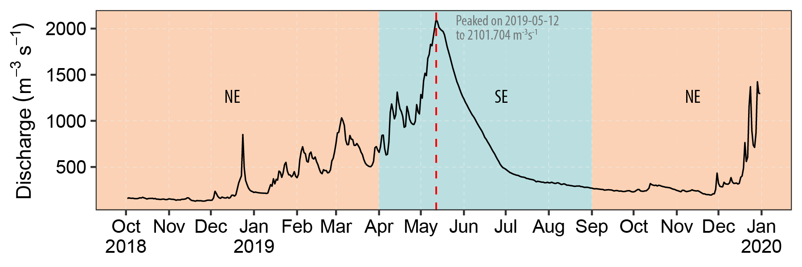

# Sythesis


Hydrographic\index{Hydrographic} data collected over the past three decades have provided a relatively coherent view of mean seasonal dynamics in the pelagic environment on the coastal\index{coastal} waters of Tanzania (*See* appendix \@ref(appendix-a) and \@ref(appendix-b)). The seasonal shift in oceanographic\index{Oceanographic} conditions like surface winds, surface currents, insolation and precipitation substantially do influence the hydrography of the coastal\index{coastal} and marine\index{marine}  water of Tanzania. The seasonal pattern in solar irradiation affects the warming of surface waters and the timing and magnitude of primary production. 

Local wind stress contributes to the mixing of the water-column and controls the direction and speed of surface water movement, hence the occurrence of upwelling events in the western side of the Pemba Channel [@semba2021]. Regional precipitation, which occurs in excess of evaporation, influences the salt content of all surface waters but more dramatically at the points of river discharge. The surface currents like the northward flowing East African coastal\index{coastal} Current also contribute significantly to the unique hydrographic properties along the coastal water of Tanzania including the Pemba Channel. 

The findings from this study reveal a considerable difference in sea surface temperature, fluorescence and dissolved oxygen between the monsoon seasons. For example,  surface waters off Kimbiji  are colder (Figure \@ref(fig:te-section)a), with high fluorescence (Figure \@ref(fig:fl-section)a) and dissolved oxygen levels (Figure \@ref(fig:ox-section)a) during southeast (SE) than during the northeast (NE) monsoon season. In waters off Kimbiji, differences in the timing and development of surface features and in the subsurface distributions of variables are influenced by the EACC, which flows northward throughout the year over the area. 

During the NEmonsoon months, this current brings warm waters with less nutrient and low chl-*a* values from the eastern of the Indian Ocean [@mahongo2014]. During the southeast monsoon season, the current still flows northward, but during this season, the water it carries has low temperature with relatively high values of chl-*a* and nutrients [@peter2018]. These parameters  are brought about in the area with wind\index{Wind} forces, which deepen the mixed layer depth\index{Mixed layer depth} and lead to mixing of surface and  bottom waters. The EACC which appears to stream fast some Kilometers offshore Kimbiji 39.78$^\circ$E to 39.95$^\circ$E longitude appears to continue northward and one of its two branches enters the Pemba Channel while the other branch passes off the eastern coast of the Pemba Island.

The seasonal shift of surface winds cause the Rufiji\index{Rufiji River} River discharge to characterize the hydrographic\index{Hydrographic} properties of water along the Kimbiji transect. Rufiji River discharge data over the period from 2018 to 2019 (Figure \@ref(fig:discharge)) were obtained from annual reports prepared by the ministry of Water, Water Resource Division. The Rufiji River discharge about 33 $cumec$ of runoff from the several rivers in the catchment. The seasonal pattern in river discharge, which peaks during the early onset of the SE monsoon season and minimal during the northeast monsoon season, is mainly influenced by regional rainfall pattern. The Rufiji River discharge\index{Discharge} is the dominant source of freshwater runoff that considerably influence the seasonal patterns of surface water quality (physico-chemical and biological parameters) off-Kimbiji during all months, but particularly during late northeast monsoon  and early southeast monsoon season. 


```{r discharge, fig.cap="Discharge of water from Rufiji River. The red dotted line indicate the date of maximum flow"}

# 
knitr::include_graphics("graphics/discharge_stigler.pdf")

```

Other oceanographic\index{Oceanographic} researches conducted in various world oceans show that sea water temperature and dissolved oxygen are the most critical environmental parameters that influence tuna and tuna like species [@blanca; @andrade]. The two environmental parameters influence not only the biological\index{Biological} processes in the ocean but also the tuna metabolism\index{Metabolism} activities and hence the survival of tuna\index{Tuna}. According to @lu, the vertical distribution of most species of tuna and tuna like species is generally influenced by the thermal\index{Thermal} and oxygen structure of the water column, whereby small sized tuna species\index{Species} and juveniles\index{Juvenile} tend to live close to the surface. By contrast, adults of large species are generally found in deeper waters. 

Tunas are apex predators which are normally found in tropical and temperate marine\index{marine} waters, with high tolerance capacity for changing temperature conditions. However, most tuna species have preferred temperature conditions [@kaplan].Dissolved Oxygen (DO) below 2mg/L have a deleterious effect to fish and other marine\index{marine} organisms including the benthic fauna that have high tolerance to low DO levels. Shallow water fish including the pelagic\index{Pelagic} fish require DO above 3.7mgL^{-1} for their body metabolism to function at optimum\index{Optimum} levels. Other studies show that among the tuna and tuna-like fishes, there are species that have relatively higher tolerance to low oxygen levels than others [@boyce].

The temperature\index{Temperature}, dissolved oxygen and fluorescence from previous expeditions in section \@ref(existing) were used to compare the season difference. However, the level of variability in parameters is not over the course of several days, but rather many years. The gap between RV Algoa and RV Agulhas II sampling off Kimbiji is thirteen years. Since much of such variability in ocean is attributable to changes in local winds and biological processes, low frequency sampling alone like hydrographic\index{Hydrographic} data from previous expedition, would not be able to resolve some of the critical oceanographic\index{Oceanographic} processes for pelagic species like tuna and tuna like. This call for attention of integrating ship-based expeditions and satellite data. 

It has long been understood that such sampling cannot provide synoptic views of parameter distributions over broad regions, but the extent to which the temporal\index{Temporal} and spatial\index{Spatial} scales of variability are confounded by shipboard observations was only fully appreciated after satellite remote-sensing\index{Remote Sensing} became accessible to the oceanographic\index{Oceanographic} community. Satellite sensors are capable of discriminating fine-scale structure in sea-surface height, temperature, phytoplankton pigments and near-surface winds over broad areas. Therefore, they measure parameters that distinguish regional and global effects on physical and biological variability. Recently, satellites\index{Satellite}  have been indispensable tools for long-term monitoring of the coastal\index{coastal} system, for assessing the temporal and spatial scales of regional variability and their links to global-scale processes and in providing a broader context for more detailed experimental studies conducted from ships or moored\index{Moor} instrument arrays. However, satellite measure only the surface layer of the ocean.  Therefore, ship-based hydrographic\index{Hydrographic} survey and other technique are still needed to measure hydrographic\index{Hydrographic} parameters below the surface of the ocean.  


# Conclusion {-}

The SAPPHIRE study conducted in the Pemba Channel and along the Tanzanian coastal\index{coastal} waters shows that: 

- The data acquired by various oceanographic\index{Oceanographic} cruises in the Tanzanian waters along with the data acquired through the SAPPHIRE project is sufficient enough for establishing the first national oceanographic\index{Oceanographic} database in Tanzania
- The oceanographic\index{Oceanographic} data acquired in the Tanzanian waters show that the sea water temperatures which ranged from 25-26$^\circ$C during the SE monsoon season
and 22-28$^\circ$C during the NE monsoon season are within the range of temperatures which
are ideal to various tuna species and other species along the coastal\index{coastal} waters of Tanzania.
- The oceanographic\index{Oceanographic} data acquired in the Tanzanian waters show that dissolved Oxygen levels which ranged from 4.70–4.76mlL^-1^ during the SE monsoon season
and 4.5 – 5.0mlL^-1^ during the NE monsoon season,  are above the lethal limit for the tuna and tuna like species.
- The ocean waters where most fishers fish are enriched with riverine nutrients (Nitrate \index{Nitrate} and
Phosphate\index{Nitrate}) which support primary productivity and in turn secondary productivity and
hence lives of apex predators like tuna.


